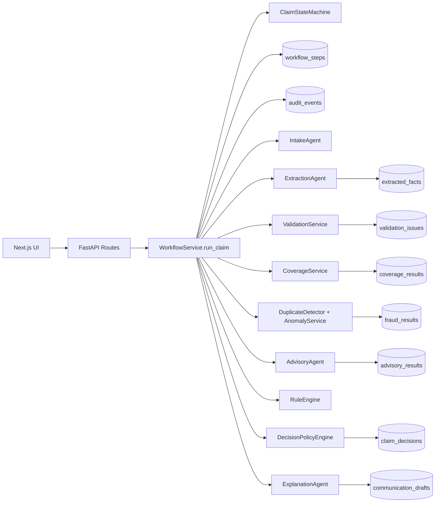
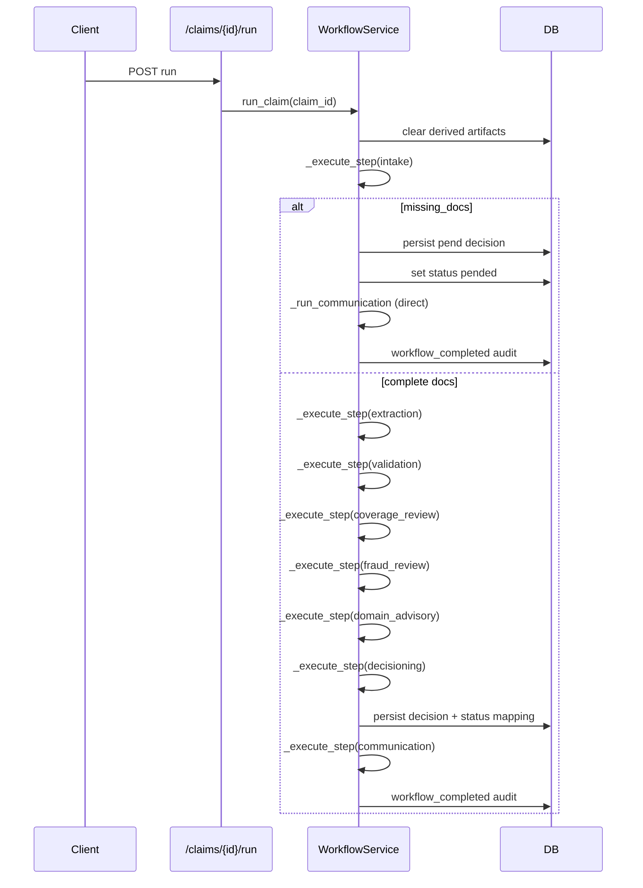
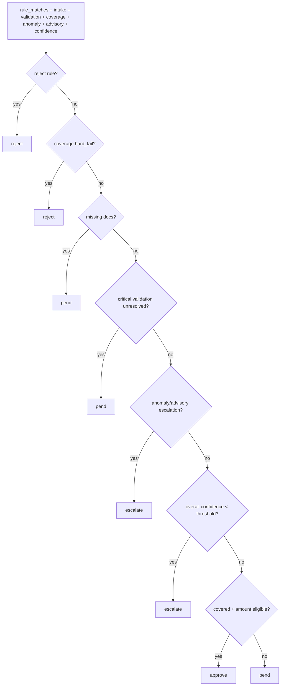

# Orchestration Walkthrough

## 1) High-level overview
The orchestration is implemented as a single, explicit supervisor pipeline in [`apps/api/app/services/workflow_service.py`](/c:/Users/AKUL/Documents/GitHub/claimflow-ai/apps/api/app/services/workflow_service.py), centered on `WorkflowService.run_claim(...)`.

Runtime step order is fixed in code:
`intake -> extraction -> validation -> coverage_review -> fraud_review -> domain_advisory -> decisioning -> communication`.

There is one early branch:
- if intake returns `missing_docs`, the pipeline short-circuits to `pend`, persists a decision, generates communication drafts, and exits.

Final adjudication is deterministic (`DecisionPolicyEngine`), not unconstrained LLM text.

## 2) File-by-file map of orchestration-related components
| File | Class / Function | Role |
|---|---|---|
| `apps/api/app/api/routes/claims.py` | `create_claim`, `get_claim_detail` | Claim intake entry and full read model for timeline/audit/outputs. |
| `apps/api/app/api/routes/workflow.py` | `run_workflow`, `rerun_from_step` | Workflow execution and rerun entrypoints. |
| `apps/api/app/api/routes/review.py` | `review_approve/reject/pend/escalate/override` | Human-in-the-loop actions and overrides. |
| `apps/api/app/api/routes/documents.py` | `upload_document` | Document ingestion/parsing/fingerprinting before workflow run. |
| `apps/api/app/api/routes/evals.py` | `seed_demo_data`, `run_evals` | Scenario seeding and eval-driven orchestration entrypoints. |
| `apps/api/app/services/workflow_service.py` | `WorkflowService.run_claim` | Main orchestrator and step sequencing. |
| `apps/api/app/services/workflow_service.py` | `_execute_step` | Status transition + workflow step persistence + audit logging wrapper. |
| `apps/api/app/workflows/state_machine.py` | `ClaimStateMachine.can_transition` | Allowed status transition validation. |
| `apps/api/app/services/intake_agent.py` | `IntakeAgent.run` | Required-doc set + completeness + missing docs. |
| `apps/api/app/services/extraction_agent.py` | `ExtractionAgent.run` | Heuristic extraction into structured entities. |
| `apps/api/app/services/validation_service.py` | `validate` | Contradictions + required field checks + domain consistency checks. |
| `apps/api/app/services/coverage_service.py` | `evaluate` | Deterministic auto/healthcare coverage evaluation from synthetic refs. |
| `apps/api/app/services/anomaly_service.py` | `score` | Risk scoring and recommended action from signals. |
| `apps/api/app/services/advisory_agent.py` | `run` | Domain advisory findings/escalation recommendation. |
| `apps/api/app/services/decision_policy.py` | `DecisionPolicyEngine.decide` | Final deterministic decision precedence engine. |
| `apps/api/app/services/review_service.py` | `apply_action` | Human decision creation and claim status override path. |
| `apps/api/app/services/rule_engine.py` | `evaluate` | YAML rule matching (`auto_rules.yaml`, `healthcare_rules.yaml`). |
| `apps/api/app/repositories/workflow_repository.py` | `start_step`, `complete_step` | Persist `workflow_steps` (state before/after, output, latency). |
| `apps/api/app/repositories/audit_repository.py` | `log` | Persist `audit_events`. |
| `apps/api/app/services/llm_client.py` | `generate_structured` | Optional LLM client abstraction (not called by workflow). |
| `apps/api/app/services/prompt_registry.py` | `load` | Prompt contract loader (not called by workflow). |
| `apps/api/app/prompts/*/v1.json` | prompt contracts | Versioned contract artifacts, currently not runtime-invoked. |

## 3) Exact entry points
### Claim creation
- `POST /claims` -> [`apps/api/app/api/routes/claims.py`](/c:/Users/AKUL/Documents/GitHub/claimflow-ai/apps/api/app/api/routes/claims.py) `create_claim` -> `ClaimRepository.create`.

### Claim run
- `POST /claims/{claim_id}/run` -> [`apps/api/app/api/routes/workflow.py`](/c:/Users/AKUL/Documents/GitHub/claimflow-ai/apps/api/app/api/routes/workflow.py) `run_workflow` -> `WorkflowService.run_claim`.

### Rerun step
- `POST /claims/{claim_id}/rerun-step/{step_name}` -> `rerun_from_step` -> `WorkflowService.rerun_step` -> `run_claim(..., rerun_from_step=step_name)`.
- Current behavior: logs rerun request but executes full workflow again.

### Human override
- `POST /claims/{claim_id}/review/override` -> [`apps/api/app/api/routes/review.py`](/c:/Users/AKUL/Documents/GitHub/claimflow-ai/apps/api/app/api/routes/review.py) `review_override` -> `ReviewService.apply_action`.

## 4) End-to-end sequence (auto claim)
Example scenario: `auto_01_straightforward_approve` from [`apps/api/app/seed/scenarios.json`](/c:/Users/AKUL/Documents/GitHub/claimflow-ai/apps/api/app/seed/scenarios.json).

1. Claim exists with auto packet docs (`claim_form`, `accident_narrative`, `repair_estimate`).
2. `run_claim` clears previous derived artifacts for this claim.
3. `intake` step runs (`IntakeAgent.run`), detects no missing docs.
4. `extraction` step runs per document (`ExtractionAgent.run`), stores extracted entities in `extracted_facts` and updates document extraction metadata.
5. `validation` runs (`ValidationService.validate`), including contradiction checks.
6. `coverage_review` runs (`CoverageService._evaluate_auto`) against auto policy reference file.
7. `fraud_review` runs (`DuplicateDetector.detect` + `AnomalyService.score`).
8. `domain_advisory` runs (`AdvisoryAgent._run_auto`).
9. `decisioning` builds rule facts, evaluates YAML rules, computes aggregate confidence, then calls `DecisionPolicyEngine.decide`.
10. Decision is persisted in `claim_decisions`, claim status mapped (`approve -> approved`), queue updated.
11. `communication` creates audience drafts (`internal`, `claimant`, `adjuster`) and stores `communication_drafts`.
12. Workflow completion audit event is written.

## 5) End-to-end sequence (healthcare claim)
Example scenario: `health_01_routine_approve` from [`apps/api/app/seed/scenarios.json`](/c:/Users/AKUL/Documents/GitHub/claimflow-ai/apps/api/app/seed/scenarios.json).

1. Claim exists with healthcare packet docs (`claim_form`, `billing_statement`, `coding_summary`).
2. `intake` validates required healthcare docs and completeness.
3. `extraction` parses `member_id`, `provider_id`, `date_of_service`, diagnosis/procedure codes, units, billed amount.
4. `validation` checks contradictions, required fields, and coding consistency.
5. `coverage_review` runs (`CoverageService._evaluate_healthcare`) using `members.json`, `plans.json`, and `providers.json`.
6. `fraud_review` scores duplicate/risk signals.
7. `domain_advisory` runs (`AdvisoryAgent._run_healthcare`) for plausibility/escalation signals.
8. `decisioning` applies deterministic precedence and returns final outcome.
9. Decision row is persisted, claim status is updated, and communication drafts are created (`internal`, `provider`, `adjuster`).

## 6) How claim state transitions are handled
- Transition rules are declared in [`apps/api/app/workflows/state_machine.py`](/c:/Users/AKUL/Documents/GitHub/claimflow-ai/apps/api/app/workflows/state_machine.py) (`ClaimStateMachine._register_defaults`).
- Enforcement is done in `WorkflowService._set_claim_status`; invalid transition raises `ValueError`.
- `_execute_step` always calls `_set_claim_status` before running stage logic.
- Special case: `ReviewService.apply_action` sets `claim.status` directly and does not call `ClaimStateMachine`.

## 7) How each agent/service is invoked
Invocation is direct synchronous method calls inside `WorkflowService`:
- `_run_intake` -> `IntakeAgent.run`
- `_run_extraction` -> `ExtractionAgent.run` (per document)
- `_run_validation` -> `ValidationService.validate` (internally `ContradictionAgent.run`)
- `_run_coverage` -> `CoverageService.evaluate`
- `_run_fraud` -> `DuplicateDetector.detect` + `AnomalyService.score`
- `_run_advisory` -> `AdvisoryAgent.run`
- `_run_decision` -> `RuleEngine.evaluate` + `DecisionPolicyEngine.decide`
- `_run_communication` -> `ExplanationAgent.generate`

No queue, no async worker, and no multi-process planner are used in this implementation.

## 8) How outputs are persisted after each step
- Step envelope: `workflow_steps` via `WorkflowRepository.start_step/complete_step`.
- Intake: only persisted in `workflow_steps.output`.
- Extraction: `claim_documents.document_type`, `claim_documents.extraction_confidence`, and `extracted_facts` rows.
- Validation: `validation_issues` rows.
- Coverage: `coverage_results` row.
- Fraud/anomaly: `fraud_results` row.
- Advisory: `advisory_results` row.
- Decisioning: `claim_decisions` row + `claims.final_decision_id` + `claims.current_queue`.
- Communication: `communication_drafts` rows.

Short-circuit nuance:
- missing-doc intake branch calls `_run_communication` directly, so there is no `workflow_steps` record for `communication` in that branch.

## 9) How the final decision is produced
Final decision path in `WorkflowService._run_decision`:
1. Build `rule_facts` from extracted facts + intake + coverage + anomaly context.
2. Evaluate YAML rules (`RuleEngine.evaluate`).
3. Compute `overall_confidence` as mean of intake, extraction, coverage, advisory confidence values.
4. Call `DecisionPolicyEngine.decide` with all stage outputs.

Decision precedence in `DecisionPolicyEngine.decide`:
1. matching reject rule
2. coverage hard fail
3. missing docs
4. unresolved high/critical validation issues
5. anomaly/advisory escalation
6. low confidence escalation
7. covered + amount under threshold -> approve
8. fallback -> pend

## 10) How human review fits in
- Review routes call `ReviewService.apply_action`.
- Service creates a **new** `claim_decisions` row (`decided_by="human"`) with `override_of_decision_id` pointing to previous decision when present.
- Claim `final_decision_id`, status, and queue are updated.
- Human action is audit-logged as `human_review_action`.

## 11) How audit events are written
Audit writes are centralized through `AuditRepository.log`.

Workflow path emits:
- `workflow_rerun_requested`
- `workflow_step_started`
- `workflow_step_completed`
- `workflow_step_failed`
- `decision_recorded`
- `workflow_completed`

Human path emits:
- `human_review_action`

## 12) Where prompt contracts are used
Prompt contracts are stored under [`apps/api/app/prompts`](/c:/Users/AKUL/Documents/GitHub/claimflow-ai/apps/api/app/prompts) as versioned JSON files.

Current runtime usage:
- `PromptRegistry` and `LLMClient` exist but are not invoked by `WorkflowService` stages.
- `settings.prompt_version` is still persisted in:
- `advisory_results.agent_version`
- `communication_drafts.prompt_version`

## 13) What is heuristic vs truly LLM-backed
### Heuristic / deterministic (active runtime)
- Intake, extraction, contradiction detection, advisory, and explanation generation are deterministic Python logic.
- Coverage, anomaly scoring, rule evaluation, and final decisioning are deterministic Python logic.

### LLM-backed (implemented infra, not active in workflow)
- `LLMClient.generate_structured` can call an OpenAI-compatible endpoint when `enable_live_llm=true` and API key is set.
- In current orchestration, this path is not wired into stage execution.

## 14) Mermaid diagrams
### System architecture

### Workflow sequence

### Decision flow

## 15) Weak Spots / Simplifications
1. `rerun-step/{step_name}` is a full rerun; it does not restart exactly from the named step boundary.
2. Rule engine can return escalate/pend rule matches, but decision policy only explicitly consumes reject rule matches.
3. Human review bypasses state machine validation.
4. Missing-doc branch skips wrapped communication step persistence.
5. Rule path is relative (`./apps/api/app/rules`) and depends on process working directory.
6. `evidence_refs` are typically sparse, so decision evidence traceability is limited.
7. Live LLM and prompt contracts are present but not wired into active stage execution.

## 16) How to Explain This in an Interview
1. Start with architecture principle: deterministic policy decides, heuristic agents structure evidence.
2. Walk through `WorkflowService.run_claim` as the orchestration backbone.
3. Show that each step is persisted (`workflow_steps`) and auditable (`audit_events`).
4. Explain shared workflow across auto and healthcare with domain-specific logic in extraction/coverage/advisory.
5. Emphasize human-in-the-loop: overrides are new immutable decision records.
6. Be transparent about simplifications and clear extension path (wire prompt registry + live LLM into stage services).

## Code Trace
### claim creation
- [`apps/api/app/api/routes/claims.py`](/c:/Users/AKUL/Documents/GitHub/claimflow-ai/apps/api/app/api/routes/claims.py) `create_claim`
- [`apps/api/app/repositories/claim_repository.py`](/c:/Users/AKUL/Documents/GitHub/claimflow-ai/apps/api/app/repositories/claim_repository.py) `ClaimRepository.create`

### claim run
- [`apps/api/app/api/routes/workflow.py`](/c:/Users/AKUL/Documents/GitHub/claimflow-ai/apps/api/app/api/routes/workflow.py) `run_workflow`
- [`apps/api/app/services/workflow_service.py`](/c:/Users/AKUL/Documents/GitHub/claimflow-ai/apps/api/app/services/workflow_service.py) `run_claim`

### rerun step
- [`apps/api/app/api/routes/workflow.py`](/c:/Users/AKUL/Documents/GitHub/claimflow-ai/apps/api/app/api/routes/workflow.py) `rerun_from_step`
- [`apps/api/app/services/workflow_service.py`](/c:/Users/AKUL/Documents/GitHub/claimflow-ai/apps/api/app/services/workflow_service.py) `rerun_step`

### intake
- [`apps/api/app/services/workflow_service.py`](/c:/Users/AKUL/Documents/GitHub/claimflow-ai/apps/api/app/services/workflow_service.py) `_run_intake`
- [`apps/api/app/services/intake_agent.py`](/c:/Users/AKUL/Documents/GitHub/claimflow-ai/apps/api/app/services/intake_agent.py) `run`

### extraction
- [`apps/api/app/services/workflow_service.py`](/c:/Users/AKUL/Documents/GitHub/claimflow-ai/apps/api/app/services/workflow_service.py) `_run_extraction`
- [`apps/api/app/services/extraction_agent.py`](/c:/Users/AKUL/Documents/GitHub/claimflow-ai/apps/api/app/services/extraction_agent.py) `run`

### validation
- [`apps/api/app/services/workflow_service.py`](/c:/Users/AKUL/Documents/GitHub/claimflow-ai/apps/api/app/services/workflow_service.py) `_run_validation`
- [`apps/api/app/services/validation_service.py`](/c:/Users/AKUL/Documents/GitHub/claimflow-ai/apps/api/app/services/validation_service.py) `validate`

### coverage
- [`apps/api/app/services/workflow_service.py`](/c:/Users/AKUL/Documents/GitHub/claimflow-ai/apps/api/app/services/workflow_service.py) `_run_coverage`
- [`apps/api/app/services/coverage_service.py`](/c:/Users/AKUL/Documents/GitHub/claimflow-ai/apps/api/app/services/coverage_service.py) `evaluate`

### anomaly / fraud
- [`apps/api/app/services/workflow_service.py`](/c:/Users/AKUL/Documents/GitHub/claimflow-ai/apps/api/app/services/workflow_service.py) `_run_fraud`
- [`apps/api/app/services/duplicate_detector.py`](/c:/Users/AKUL/Documents/GitHub/claimflow-ai/apps/api/app/services/duplicate_detector.py) `detect`
- [`apps/api/app/services/anomaly_service.py`](/c:/Users/AKUL/Documents/GitHub/claimflow-ai/apps/api/app/services/anomaly_service.py) `score`

### advisory
- [`apps/api/app/services/workflow_service.py`](/c:/Users/AKUL/Documents/GitHub/claimflow-ai/apps/api/app/services/workflow_service.py) `_run_advisory`
- [`apps/api/app/services/advisory_agent.py`](/c:/Users/AKUL/Documents/GitHub/claimflow-ai/apps/api/app/services/advisory_agent.py) `run`

### decisioning
- [`apps/api/app/services/workflow_service.py`](/c:/Users/AKUL/Documents/GitHub/claimflow-ai/apps/api/app/services/workflow_service.py) `_run_decision`, `_persist_decision`, `_apply_decision_status`
- [`apps/api/app/services/rule_engine.py`](/c:/Users/AKUL/Documents/GitHub/claimflow-ai/apps/api/app/services/rule_engine.py) `evaluate`
- [`apps/api/app/services/decision_policy.py`](/c:/Users/AKUL/Documents/GitHub/claimflow-ai/apps/api/app/services/decision_policy.py) `decide`

### human override
- [`apps/api/app/api/routes/review.py`](/c:/Users/AKUL/Documents/GitHub/claimflow-ai/apps/api/app/api/routes/review.py) `review_override`
- [`apps/api/app/services/review_service.py`](/c:/Users/AKUL/Documents/GitHub/claimflow-ai/apps/api/app/services/review_service.py) `apply_action`

### audit logging
- [`apps/api/app/repositories/audit_repository.py`](/c:/Users/AKUL/Documents/GitHub/claimflow-ai/apps/api/app/repositories/audit_repository.py) `log`
- call sites in [`apps/api/app/services/workflow_service.py`](/c:/Users/AKUL/Documents/GitHub/claimflow-ai/apps/api/app/services/workflow_service.py) and [`apps/api/app/services/review_service.py`](/c:/Users/AKUL/Documents/GitHub/claimflow-ai/apps/api/app/services/review_service.py)
